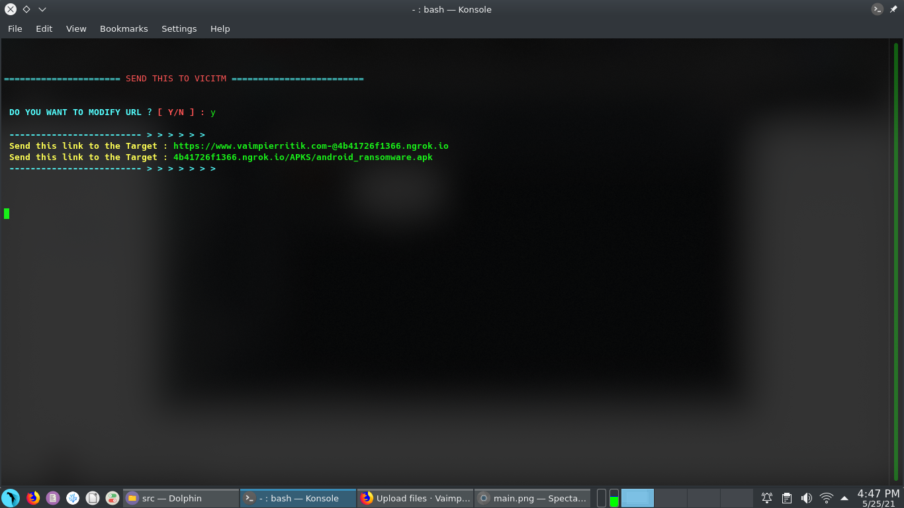
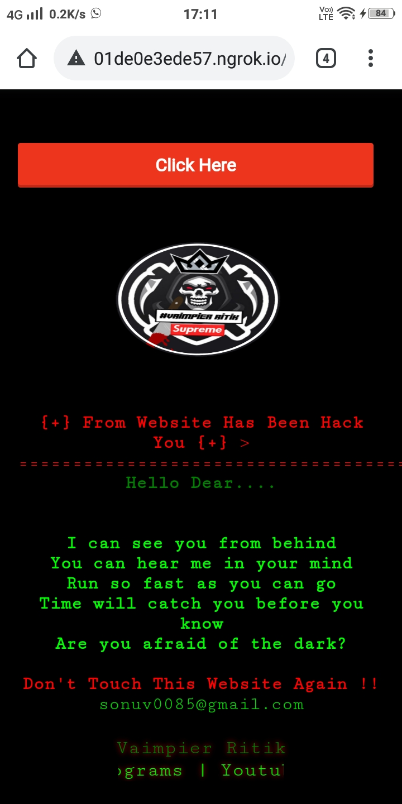

# Vaim-RamSom
 
 
 

- What is Vaim-RamSom ?
> This is simple android ransomware virus.
> Many times you just want to annoy or play a prank on your friends.
> If you find yourself in that situation then this Tool is the perfect tool for you!
> this tool made by @vaimpier_ritik

* `FUD.`

* `Supports newest Android also.`

* `Parrot Os and all Debian based supported.`

* `Use Cloud Console for use this tool in android phone.`

* `The author is not responsible for any issues or damage caused by this program and don't use illegel purpose.  `

 

### Installation & Step's
 
> `apt update && apt upgrade`
 
> `git clone https://github.com/VaimpierOfficial/Vaim-RamSom`
 
> `cd Vaim-RamSom`  
 
> `bash setup.sh`

 

### Updating & Step's
 
> `bash update.sh`

 

### Opening & Step's
 
> `bash start.sh`

 

### Dependencies

- Php
- Ngrok
- Java
  - Openjdk 11
- Aapt
- Apktool
  - Apktool 2.4.0
- Zipalign
- Imagemagick
- Python3
- Python3-pip
  - Pillow

### Tools overview
</img>

### Link overview
</img></img>

### Output 
</img>

### Support Me On
Facebook [@Vaimpier_Ritk](https://www.facebook.com/vaimpier.ritik.143) 
Instagram [@Vaimpier_Ritik](https://instagram.com/vaimpier_ritik) 
Youtube [@Vaimpier_Ritik](https://www.youtube.com/channel/UCDWhaLh7OIKzH4Bk952l7Iw)

### For Video Tutorial
- <a href="https://www.youtube.com/watch?v=Hk1PZ2Jj4yA"> CLICK HERE AND SEE TUTORIAL </a>
